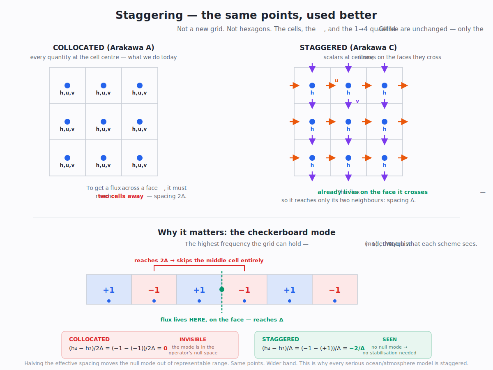

# Discretisation and information — what a nomos is actually claiming

*Written 2026-07-12/13, out of a long dialogue between Joseph and a Claude instance, prompted by Joseph supplying Cardiff & Demirdžić's* Thirty Years of the Finite Volume Method for Solid Mechanics *(`ref/research/pdfs/markdowns/cardiff-2021-thirty/`). It is not a paper summary. It is the **mental model an agent needs before authoring or reworking any field nomos**, and the reason our existing ones are naive.*

> **Read this before you touch a field nomos.** The existing kernels (`erosion.rs`, `water.rs`, `gen.rs`) were thrown together ad-hoc; **that is known and is not the point.** Joseph, 2026-07-12: *"There's very little invested into the existing nomos implementations' details. Let that be a trivial issue for the agent-engineer who is reworking it once we've nailed down the principles."* This document is the principles. Get these, and the tactical work per phenomenon is yours to do well.

**Epistemic tags, used literally.** **[P]** quoted from a primary read directly · **[≡]** a restatement — the same mathematical statement in another language, not an analogy · **[thm]** a standard theorem, checkable on paper · **[D]** derived here, check it · **[M]** measured in this repo · **[me]** my inference — a claim, not a result · **[⊘]** open.

---

## 0. The Prime Question

> # **"What physical claim is this algorithm actually making?"**

Published algorithms are **not physics**. They are physics **traded against computation**, on a substrate — flat, uniform, globally time-synchronised, square — that vivarium **is not**. Their coordinate assumptions are **disguised physical claims**, and *the claim* is what we port. Never the paper.

Joseph, 2026-07-12:

> *"It has been far too easy to just do what the paper said it was doing, plus some alterations to get it to work 'in our system.' That's never what I've wanted."*

> *"If we can't get the existing algorithm to realistically line up with a sphere or our need for multi-scale — we learn what the algorithm's underlying **physics** are and we build the better algorithm that does what we need it to do."*

**If you cannot answer the Prime Question for a nomos, you do not know what compromises you are making — and neither will anyone downstream.**

### The worked example that earned it

`erosion.rs` routes drainage with **MFD** (Multiple Flow Direction; Freeman/Quinn ~1991): split a cell's outflow among its 8 Moore neighbours, slope-weighted.

| | |
|---|---|
| **coordinate assumption** | "8 neighbours, 45° apart, diagonals at `cell·√2`" |
| **physical claim** | *"distribute outflow over the downhill directions in proportion to slope"* — MFD is a **quadrature**, and the 8 cells are its **nodes** |

Two things follow that **no amount of valence-auditing would ever have surfaced**:

1. **Four of those "neighbours" share only a VERTEX** with the cell — a zero-length edge, across which **no flux physically crosses**. The diagonals were never physics. They were a hack against D8's grid-aligned-channel artifact, and the code comment says so.
2. **On our sphere the quadrature nodes are not evenly spaced**, so the quadrature is **biased** — and **[M]** *it does not converge away*. The fan converges to the lattice sheared by the projection's **Jacobian**, whose closed form contains **no $N$**. Corner fan error: 14.2° (L5) → 15.0° (L9) → **15.0° (L19) → 15.0° (L23)**. Refining L5→L19 shrinks cells **16 384×** and moves the defect ~1° *in the wrong direction*.

**[M] Net: MFD reintroduces precisely the grid-aligned-channel artifact it was adopted to remove.** Away from a face centre its eight attractors collapse to **two**; a plume on a cone ends **474 km — twelve cell-widths — off its true meridian**, and refining makes it *worse*.

Recover the physical claim and the honest kernel falls out immediately: take the flow **direction** from the reconstructed gradient (a continuous angle — Tarboton's D-∞ idea) and split the outflow across the cell's **real edges**, of which there are **exactly 4 at every cell on the sphere, the 24 "defective" corner cells included**. No fan. No diagonals. No fixed-distance assumption. Any valence. Exactly conservative. **[M]** 5.17% vs 20.76% catchment error.

> **This is the shape of the work. It is `physics-not-knobs` applied to GEOMETRY instead of to constants.**

---

## 1. The first question after the Prime Question

When an algorithm's assumption *is* violated on our topology, the first question is **not** "how large is the error."

> # **Is it a BIAS, or is it NOISE?**

- **Noise** washes out. Drainage area sums over a large upstream catchment; the law of large numbers eats random error.
- **Bias** **manufactures a fake physical law**, and it **compounds** downstream.

Same magnitude. Categorically different harm. And it **reorders the remedies available to you**:

| remedy | admissible? |
|---|---|
| *"the error is negligible at this scale"* | **ONLY if it is noise.** If it is a bias, this defence is **never** admissible at any scale — a fake law does not become true when you zoom in. |
| supply the true metrics (real distances, real areas) | necessary, **usually insufficient** — **[M]** true distances take MFD's plume drift 5.45° → 4.04° and the attractor pair *survives*. *A distance fix cannot fix a fan that is not a fan.* |
| **fated stochastic jitter** | **principled, and not a hack** — it is a **bias → variance conversion**, and §5 shows it is *forced*, with its amplitude *determined*, not chosen. |
| **recover the physical claim and rebuild the kernel** | the principled path, and usually the right one. |

---

## 2. What Cardiff gives us — the taxonomy we lacked

### 2.1 The sentence that indicts our current kernels

> *"Building on the foundations of the finite difference method, the finite volume method is a generalisation in terms of geometry and topology: **simple finite volume schemes reduce to finite difference schemes.** Whereas the finite difference method is based on nodal relations for **differential** equations, the finite volume method balances forces acting on control volumes, directly discretising the **integral** form of the conservation laws."* **[P]** §1

Read that twice. **FDM operates on *point values* and the *differential* form. FVM operates on *cell contents* and the *integral* form.** That is the whole distinction, and it is **exactly** the point-sample-vs-cell-average fork that vivarium has never decided.

**Our naive uniform five-point stencil, operating on values whose meaning was never declared, is finite differences wearing finite volume's clothes.** Which is precisely why it conserves nothing it was not explicitly told to, and why **[M]** its error *grows* under refinement.

### 2.2 Every method decomposes into four choices

> *"The distinction between the variants can be narrowed down to four components: **1. Control volume construction; 2. Face gradient calculation; 3. Stabilisation approach; 4. Solution methodology.**"* **[P]** §3.5

*Cardiff Fig. 18: every FV scheme in thirty years of literature is a path through four choices. The coloured lines are the famous ones. **Note the branches nobody has walked.***

This is the mature form of Joseph's own triplet — *(physical-process, mathematical-concerns, computational-concerns)*. **And the axes LEAK.** Stabilisation (§2.5) is a *computational* pathology, cured by a *mathematical* device, that silently alters the *physics*. **Every place they leak is a place an unphysical term entered the world and nobody wrote it down.** That is the same audit as `ASSUMPTIONS.md`, one level deeper.

### 2.3 "Two levels at every LOD" — Joseph's question, answered by a thirty-year war

Joseph, 2026-07-12: *"At every level of detail there are **2** levels at which an algorithm can run… the points are the vertices of a mesh. If you care about topology, it's the **mesh geometry** you are working on. Which will have to properly and lawfully reduce back to the column points."*

The literature has four answers, and Cardiff draws all of them on one picture:

> *"Illustration of the four ways to construct control volumes on a primary mesh: (1) **cell-centred** (green); (2) **vertex-centred with non-overlapping** control volumes (blue); (3) **vertex-centred with overlapping** control volumes (red); and (4) **staggered-grid** (purple)."* **[P]** Fig. 11

| construction | unknowns live at | control volumes are |
|---|---|---|
| **cell-centred** | cell centroids | the primary mesh cells themselves |
| **vertex-centred** | the primary mesh **vertices** | a **DUAL mesh** built around each vertex |
| **staggered** | **different components in different places** | a different set per component |
| **face-centred** | faces | (recent, rare) |

**Note what the left half of the figure shows:** on a *triangular* primary mesh, the vertex-centred dual control volume **is a hexagon**. Hold that; it comes back in §7.

**And the lawful reduction Joseph asked for exists:**

> *"The finite element **mass-lumped** approach can be seen to **coincide with the finite volume approach**; from this, we can see that the finite element lumped approach is essentially **assigning the mass of the hexagon surrounding a node to the node itself**, corresponding with the integration domain of the finite volume approach."* **[P]** §4.4.4

**Lumping the FEM mass matrix collapses it exactly onto the FV dual cell.** Primal and dual are the same object through two doors, and mass-lumping is the door.

### 2.4 The reconstruction — and the answer to the volume question

Cardiff Eq. (2), the cell-centred FV reconstruction:

$$\boldsymbol{u}(\boldsymbol{x}) = \boldsymbol{u}_P + (\boldsymbol{x} - \boldsymbol{x}_P) \cdot (\nabla \boldsymbol{u})_P$$

> *"This expression says that the displacement $u(x)$ at any point in the cell can be calculated using the cell-centre displacement $u_P$ and the constant gradient of displacement within the cell $(\nabla u)_P$. This approximation is second-order in space."* **[P]** §3.2.3

**[D] Now integrate it over the cell.** The gradient term contributes $(\nabla u)_P \cdot \int_\Omega (\boldsymbol{x} - \boldsymbol{x}_P)\,d\Omega$ — **and that integral is exactly zero, by the definition of the centroid.** So the cell-average of the reconstruction is **exactly $u_P$**.

> ### **[D] There IS a surface with exact volumetric fidelity, and it is not exotic: a piecewise-linear reconstruction about the CENTROID, carrying cell-average values. Volume-exact *by construction*, at every cell, with zero epsilon — and it HAS a slope.**

Joseph asked whether such a mesh existed. It has existed for thirty years. **The price is that it is DISCONTINUOUS at the cell faces:**

*Cardiff Fig. 24. **Left (orange): the finite-volume field.** Each cell owns its own tilted plane — a value plus a gradient — and **they do not meet at the faces.** **Right (blue): the finite-element field** — one continuous surface. **These are the two things vivarium has been conflating in a single `Vec<f32>`.***

**And the jump is not a defect. It is information.** Godunov-type schemes *consume* it — solving a Riemann problem at each face to resolve the two-sided disagreement into a physically-correct flux — and adaptive-mesh methods use the **jump size as the refinement criterion**. It is the scheme's own declared uncertainty, in the units of the field.

> **The jump at the face IS the epsilon on the reconstruction.**

**⇒ It resolves the Minecraft conflation.** A Minecraft column is the **zeroth-order** version of this (a flat plane, zero gradient — so trivially both a "point" and a "cell average"). Add the gradient and the two split. **The column was never the mesh. A column is a cell average plus a gradient; the "mesh" is a *rendering choice*.**

### ⚠ 2.4a — CORRECTION: the project ALREADY declared this. It was not undeclared. It was UNENFORCED.

*Added 2026-07-13, after an onboarding audit caught the author asserting a stronger and more flattering claim than the evidence supports. Corrected in place — because the real finding is sharper than the one it replaces.*

**An earlier draft of this document claimed *"nobody has ever said what a stored value means."* That is FALSE.** `doc/design/DESIGN-MATERIAL.md` §4 — **a Level-B document** — said it, and said it *well*:

> *"**The conserved primitive is volume / mass of material** — not a height. Erosion and hydrology move mass; conservation is the thing that must survive every LOD crossing. **This is finite-volume thinking** (store the cell-integrated conserved quantity), which is the correct frame for the physics."*
>
> *"**Surface elevation is a derived reading**: top-of-topmost-solid, sampled at the column's center — **a finite-difference node**. *(Settled by code… §14 just names it so **a later tier can't quietly treat it as a mean/max**.)*"*
>
> *"Converting between these readings (volume↔height, sample↔mean) is **lossy and directional** → it is **coupler** work, and any downscale must honor whichever statistic was stored."*
>
> *"Prior art (not novel): finite-volume vs finite-difference; GDAL `AREA_OR_POINT` and DEM grid registration (**a cell value's meaning must be declared**); **Arakawa staggering**; Volume-of-Fluid."* — **[P]** `DESIGN-MATERIAL.md` §4

**Read that, then read the bug.** The project made the FV/FD carve; named the conserved primitive; declared elevation a *derived* FD node; identified the conversion as **lossy, directional, coupler work**; cited **Arakawa staggering** as prior art — **and wrote a guard whose literal stated purpose was to stop a later tier from quietly treating it as a mean.** Then `mean-pin` treated it as a mean, the coupler was never built, and nobody noticed for months.

> ### **The finding is not "the semantics were undeclared." It is: THE SEMANTICS WERE DECLARED, A GUARD WAS WRITTEN, AND THE CODE DRIFTED THROUGH IT ANYWAY.**
>
> **That is strictly worse — and it indicts the project's own thesis.** `README.md`: *"Epistemic honesty is enforced in code, not culture."* **Here it was not.** The declaration lived as **prose in a Level-B doc with nothing mechanical behind it** — no `NomosDecl` field, no test, no store key. **A declaration that cannot fail a build is a wish.** Same class as an unaccounted magic constant, same fix: **it must become DATA the audit can check** (§6 item 5), not prose a future reader may skip.

**And the author committed the same sin one level up.** §7(a) of this document originally announced staggering as *"a lead the grid report never tested."* **It is sitting in `DESIGN-MATERIAL` §4's prior-art list.** The author never read that Level-B doc *while writing a Level-B doc* — precisely the failure the Prime Question exists to prevent.

> **Generalise it, because it is the sharpest lesson in this file: BEFORE CLAIMING SOMETHING IS NEW, READ WHAT THE PROJECT ALREADY DECIDED.** The archaeology is cheaper than the rediscovery — and a rediscovery presented as a discovery is dishonest by omission, even when it is entirely sincere.

### 2.5 ⚠ The invisible modes — the thing I did not see coming

**A discretisation has a NULL SPACE: modes it literally cannot see.**

In FV they are called **checkerboarding**:

> *"the 'checker-boarding' phenomenon, where high frequency variations appear in the solution variables that are **unobservable to the discretisation**."* **[P]** §2.3

In FEM they are called **hourglassing**. Cardiff proves they are the same disease:

> *"The origin of these spatial instabilities in both finite element and finite volume formulations is a **rank deficiency** in their respective stiffness matrices. Essentially, **a stable discretisation should not support any deformation modes which do not offer resistance**, apart from rigid body translations and rotations."* **[P]** §4.4.5

**And the universal cure is to add ARTIFICIAL DIFFUSION** — Rhie–Chow, Jameson–Schmidt–Turkel, Godunov upwinding — each with a **user-defined scaling factor $\alpha^{\text{stab}}$** (Cardiff Eq. 58; he then shows they are *algebraically the same term*).

$$\boldsymbol{t}^{\text{stab}}_{\text{Rhie–Chow}} = \alpha^{\text{stab}} K_f\left(\frac{\boldsymbol{u}_N - \boldsymbol{u}_P}{|\boldsymbol{d}_f|} - \boldsymbol{n}_f \cdot \frac{|\boldsymbol{d}_{Nf}|\nabla\boldsymbol{u}_N + |\boldsymbol{d}_{Pf}|\nabla\boldsymbol{u}_P}{|\boldsymbol{d}_f|}\right)|\boldsymbol{\Gamma}_f|$$

> ### ⚠ **I APPLIED THIS TO `water.rs` AND WAS WRONG — READ THE RETRACTION, IT IS MORE USEFUL THAN THE CLAIM**
>
> An earlier draft asserted: *"the θ flux-smoothing is **Rhie–Chow-class** stabilisation, and the travelling soliton blobs it was added to kill **were the invisible mode**."* **A red-team pass falsified both halves against the primary and against the running kernel. [M] [P]**
>
> - **Wrong family.** de Almeida et al. 2012 say their momentum discretisation is *"inspired by the **Lax–Friedrichs** model"* — a monotone-flux / artificial-viscosity device from the **hyperbolic conservation law** lineage. **Rhie–Chow cures a rank deficiency of a COLLOCATED grid — and `water.rs` is already STAGGERED.** Its head operator is $\eta_i - \eta_j$ *across the face*: a 2-point difference at spacing $\Delta$, symbol $2\sin(k\Delta/2)/\Delta$, which at Nyquist is $2/\Delta \neq 0$. **There is no null mode for a Rhie–Chow term to cure.**
> - **Measured.** Feed the real kernel its own Nyquist mode and it **decays to 78% in 8 steps** — damped by the head operator alone (θ is provably a no-op on step 1; the flux arrays start at zero). **A null mode is invariant or grows without resistance. Ours is SEEN and DAMPED.**
> - ⚠ **And `water.rs` is therefore a COUNTEREXAMPLE to this document's own §7(a)**, which claimed staggering ⇒ *"no stabilisation needed… never required."* **`water.rs` IS staggered, HAS no null mode, and needs THREE stabilisers.** §7(a) is corrected there.
>
> **[inferred — the replacement hypothesis, with a probe attached] The solitons are probably ROLL WAVES, which are PHYSICALLY REAL.** *Travelling* multi-metre waves with near-dry troughs is the signature of the **Vedernikov instability**, not a stationary checkerboard. $Ve = (\beta-1)\cdot Fr$, unstable at $Ve>1$: Chézy ($\beta=3/2$) → $Fr=2$; **Manning ($\beta=5/3$, what `water.rs` uses) → $Fr=1.5$.** ⚠ **`water.rs` counts supercritical cells at $Fr>1.5$ and caps breaking flux at $Fr=2.0$ — exactly the Manning and Chézy roll-wave criticals.** If that holds, **θ is not suppressing a numerical artifact; it is suppressing a real phenomenon the scheme cannot render** (local-inertial drops the very advection term that sets a roll wave's shape and speed) — **and *"waves with dry ground between them are physically absurd"* becomes the thing to revisit, because that is what roll waves look like.** *The probe that decides it: raise Manning $n$ until $Ve<1$ at fixed θ. Blobs vanish with friction alone ⇒ roll waves (physical). Only θ kills them ⇒ numerical mode.*
>
> **WHAT SURVIVES:** *θ's physical claim is NONE* — the primary says so in the authors' own words (*"a weighting factor that adjusts the amount of **artificial numerical diffusion**"*, coefficient $(1-\theta)$). ⚠ **But `water.rs:352` says otherwise and nobody reconciled them:** it calls θ *"the stand-in for the neglected momentum-advection term"* — **a physical claim, un-sourced, that the cited paper does not make.** And **θ IS a bias — by a different mechanism than I claimed: it preserves the flux MEAN and destroys flux VARIANCE ([M] 24% over 200 passes). Sediment capacity ∝|v| and incision ∝ vⁿ are superlinear ⇒ by Jensen (§3.3) it systematically UNDER-predicts transport.**
>
> ### ⚠⚠ And the finding that actually matters, which I never went looking for
>
> **de Almeida & Bates 2013 — the applicability study `water.rs` itself cites — bounds the local-inertial model at $Fr<0.5$, diverging to $Fr=1$, and states outright that *"the physical characteristics of the flow field of supercritical flow with a Froude number of greater than 1 CANNOT BE CORRECTLY EXPRESSED by the local inertial model."* [P]**
>
> **[M] On real 60-epoch eroded land: ~5.7% of wet cells run supercritical ($Fr>1.5$)** — and those are the steepest, fastest cells, **exactly the ones doing the erosive work.** Worse: **`max Fr = 2.00`, bit-identical at every sample. The breaking cap is SATURATED — the instrument is reading its own clamp.** *(Same species of tell as the "22888" divide-by-zero.)*
>
> ⇒ **The honest audit finding is not "θ lacks a fluctuation partner." It is: WE ARE RUNNING OUTSIDE THE PUBLISHED VALIDITY ENVELOPE OF THE MOMENTUM EQUATION WE CHOSE, AND THREE STABILISERS ARE HOLDING IT TOGETHER.** `ASSUMPTIONS.md`'s *"used as intended"* is the claim to retire. See `DECISIONS[water-runs-outside-its-published-validity-envelope]`.
>
> ⚠ **AND I PROSECUTED THE WRONG TERM.** θ is the **symmetric, mean-preserving** one. The same function contains **three ONE-SIDED clips** — `.max(0.0)` on flux, the Froude cap (**measured saturated**), and the outflow scale-down — **each of which is a BIAS BY CONSTRUCTION under §1, because a sign-definite operation cannot average out.** Plus `depth = (…).max(0.0)`: **a positivity clamp is a silent MASS SOURCE if it fires. Unprobed.** *The audit needs the clip activation rates, not θ's.* ⚠ **And none of it can be tested as written: θ (`0.8`), the Froude cap (`2.0`), and Jarrett's constants are HARDCODED LITERALS inside `WaterSim::step()`, not `WaterParams` fields. An assumption you cannot vary is an assumption you cannot test.**

**And Cardiff hands us a mechanical probe for it** — the only thing in this entire investigation that tells us *what we cannot see*:

> *"Consider a **periodic patch** of finite volume cells, containing a central cell and all neighbour cells within its computational stencil (Fig. 17), and **analyse the eigenvalues of its (block-coupled) global stiffness matrix**… For a stable formulation, **the number of zero valued eigenvalues is equal to the number of rigid degrees of freedom**… For an unstable formulation, there will be **additional zero valued eigenvalues, where the corresponding eigenvector indicates the unstable mode**."* **[P]** §3.5.3

**Count the zero eigenvalues. Every one beyond the rigid-body modes is a mode your kernel is blind to, and its eigenvector *tells you what it looks like*.** This is a falsifiable, runnable test for *"where is my scheme blind"* and we should run it on every field nomos we own.

### 2.6 Why FVM and not FEM, for us — decided on conservation, not taste

> *"As finite volume approaches discretise surface integrals at the (typically non-overlapping) control volume boundaries, **strong local conservation is achieved**: forces are equal and opposite at cell boundaries. As a consequence of this local conservation, global conservation within the domain is automatically achieved. **In contrast, finite element methods discretise the surface force term as a volume integral using locally overlapping integration domains: this results in local conservation in an average sense, rather than directly for each element.**"* **[P]** §4.4.2

> *"…finite volume methods **satisfy [traction/flux] conditions exactly regardless of the mesh density**; whereas finite element approaches satisfy them in an approximate sense."* **[P]** §4.4.2

**For a project whose central unsolved problem *is* a flux boundary condition between tiles, that second quote is decisive.** And the geometric flexibility points straight at us:

> *"…finite volume approaches [can] deal with general convex polyhedral meshes… **In addition to hanging nodes**, typical finite volume discretisations can deal with **overset/chimera and immersed boundary meshes** in a straight-forward manner."* **[P]** §4.4.3

**"Hanging nodes" is our coarse↔fine tile seam. "Overset/chimera" is Joseph's "multiple grids with bridges."** The literature for what we want *exists*.

*(Formal bridge, for completeness: choosing **unity weighting functions** in FEM's weak form recovers FVM exactly — Cardiff §4.4.2, citing Spalding's "unity-weighting-function methods." FVM ⊂ FEM, formally.)*

---

## 3. The information-theoretic dictionary — the more powerful lens

Everything above has an equivalent form in sampling theory and information theory, and **most of it is not an analogy — it is the same statement.** Joseph found this lens far more native, and it is also the one most likely to yield realizable algorithms with an honest physical interpretation.

**Discretisation is *sampling*.** Cell size $\Delta$ ⇒ Nyquist wavenumber $k_N = \pi/\Delta$. Content above $k_N$ is **not representable**, and you have exactly two options: *filter it out before sampling*, or *let it fold back*.

### 3.1 [≡] Cell-average = anti-aliased. Point-sample = aliased.

$\bar h_i = \frac{1}{A}\int_{\text{cell}} h$ **is literally a convolution with a box kernel, followed by a sample.** A cell average *is* a low-pass filter. A raw point sample is the same operation with the filter omitted — so unrepresentable high-frequency content **folds back down and masquerades as large-scale structure.**

> **The column-semantics fork is the ANTI-ALIASING fork.** It has been a solved problem in signal processing since Shannon.

**And it re-diagnoses our bug precisely.** `gen::initial_topography_m(seed, cell, **nyquist_level**)` band-limits the fBm to the cell's Nyquist — **the generator is deliberately anti-aliasing, and is doing the right thing.** The conservation code (`mean-pin`) assumes a **cell average**. The renderer (`voxel.rs`, **bilinear**) assumes a **point sample**. **[M]** *The three-way ambiguity in the code is a three-way disagreement about which filter was applied before sampling.*

### 3.2 [≡] The invisible mode is the Nyquist mode

A checkerboard is $(-1)^{i+j}$ — **exactly the Nyquist frequency**. Apply a central difference: $u_{i+1} = -u_i$ and $u_{i-1} = -u_i$, so $(u_{i+1}-u_{i-1})/2\Delta = 0$.

> **[≡] The checkerboard mode is in the null space of the operator. Cardiff's "rank deficiency" is: the scheme's TRANSFER FUNCTION HAS A ZERO AT NYQUIST.**

This is ordinary Fourier (von Neumann) stability analysis. And it explains **staggered grids** exactly: staggering **halves the effective spacing for the derivative**, which **moves the null mode out of representable range**. It adds no points; it *uses the same points better*.

> **[≡] Stabilisation is a HIGH-PASS DAMPING FILTER, added to make the transfer function nonzero on its own null space. $\alpha^{\text{stab}}$ is a FILTER GAIN, not a fudge.**

### 3.3 [≡] Jensen's inequality IS aliasing

Take a field band-limited to $k_N$ and square it. The product has content up to $2k_N$ — **unrepresentable, so it folds back**.

> ⚠ **CORRECTED 2026-07-13 — THIS WAS THE ANALOGY IN COSTUME, AND THE RED TEAM FOUND IT.** An earlier draft claimed *"**[≡]** Jensen's inequality and aliasing of nonlinear terms are one phenomenon, two vocabularies."* **They are NOT the same statement.** They share a **parent** — *nonlinearity does not commute with projection* — but they are **different consequences in different representations**: in the **cell-average** representation the residue is a **sign-definite BIAS IN THE MEAN** (Jensen); in the **point-sample** representation it is a **fold-back that redistributes energy among the resolved modes**, and it is **not sign-definite** (aliasing — which the 2/3 rule prevents, and which does *not* prevent a Jensen bias). **§3.1 above carefully separates cell-average from point-sample; this section then merged their error modes.** That is exactly the failure this document warns about, committed by its author, three sections after warning about it. **Demoted from [≡] to [me]: a shared parent, not an identity.**

> ### ⚠⚠ CORRECTED 2026-07-13 — I NAMED THE WRONG VARIABLE, THE WRONG STATISTIC, AND THE WRONG SIGN.
>
> An earlier draft argued: *"stream power is $E = K A^m S^n$, **nonlinear in slope**… for $n>1$ you systematically **UNDER**-estimate erosion."* **Read the kernel. `incise()` runs $n = 1$** — the Braun–Willett implicit solve `h ← (h + f h_r)/(1+f)`, which is **exact *because* $n=1$**. ⇒ **At $n=1$ stream power is LINEAR IN SLOPE, and the Jensen gap in $S$ is EXACTLY ZERO.** The Prime Question, turned on the author: *I argued about the algorithm I imagined instead of the one in the file.*
>
> **[D] The two gaps that ARE there — and both push the SAME way:**
>
> 1. **Jensen on $A^{0.5}$.** $m=0.5<1$, so $A^m$ is **concave**: $\overline{A^{1/2}} \le \bar A^{1/2}$. Using the mean $A$ **OVER-estimates.**
> 2. **Negative covariance $\mathrm{Cov}(A^m, S) < 0$.** Channels are **high-$A$/low-$S$**; hillslopes are **low-$A$/high-$S$** — strongly anti-correlated in any real landscape. So $\overline{A^m S} < \overline{A^m}\,\bar S$. **OVER-estimates** again.
>
> ⇒ **For the kernel we actually run, coarse-graining OVER-estimates incision — and the sufficient statistic required is the JOINT sub-grid distribution of $(A, S)$, at minimum their COVARIANCE. Not the marginal variance of $S$.**
>
> **And the payoff is bigger than the correction: $A$ is exactly what the ROUTER computes.** The routing bias and the coarse-graining bias **enter through the same variable.** A biased fan mis-concentrates $A$; a coarse cell then evaluates $A^{0.5}$ on the mis-concentrated mean. ⇒ **The routing fix is the PRECONDITION for the sufficient-statistic contract being well-posed at all** — you cannot carry an honest sub-grid distribution of a quantity your router is systematically mis-routing.

> **Coarse-graining a nonlinear law does not lose precision. IT LIES.** The conclusion stands; only the variable, the statistic and the sign were wrong. Carrying only the mean asserts the sub-grid structure is *absent*. It is not. *(And per the LEM survey: **nobody in the field carries a sub-grid distribution through the erosion law.** Their two answers are "re-tune $K$ per resolution" — which they themselves call a fudge — or "fix the routing so the dependence goes away.")*

### 3.4 ⚠ [thm] Fated jitter is not a hack — it is a THEOREM

Coarse-graining is **irreversible**; the discarded information is exactly what gives a coarse-grained model an arrow of time. **[thm] Mori–Zwanzig**: coarse-grain an exactly reversible microscopic system and the coarse system *necessarily* acquires **two** terms it did not have —

$$\underbrace{\text{memory kernel}}_{\textbf{DISSIPATION}} \;\;+\;\; \underbrace{\text{orthogonal-dynamics term}}_{\textbf{NOISE}}$$

— and their magnitudes are **tied to one another** by the **fluctuation–dissipation theorem**, through **the variance you discarded**.

> # **Dissipation and fluctuation are a PAIR. You do not get to keep one.**

Consequences, and they are large:

⚠ **CORRECTED 2026-07-13 — the `[thm]` tag does NOT survive, and the red team was right to take it.** The Mori–Zwanzig **decomposition** is exact ✓. But the **magnitude tie — the second FDT — holds with respect to an EQUILIBRIUM (Gibbs) measure.** A landscape under uplift and rain is **driven, dissipative, and far from equilibrium, with no invariant Gibbs measure**; the relation does not hold there in general. ***"Its amplitude is DETERMINED" is not handed to you by a theorem.*** And a second, independent error: **MZ/FDT is about coarse-graining REAL PHYSICS — and I applied it to θ, which I had just declared a purely numerical stabiliser with no physical claim. You cannot say "its physical claim is NONE" and then demand its FDT-mandated fluctuation partner**; that would fabricate sub-grid variance with **no physical referent**, tuned to a discretisation parameter.

**What survives, and it is still worth having:**

- **Joseph's "fated stochastic jitter" is the FLUCTUATION HALF of the pair, and it is not dithering.** The discarded variance sets both **in principle** — and, crucially, **it can be MEASURED from resolved fine runs** (this is exactly what LES's *dynamic procedure* does). So jitter's amplitude is **derivable from measurement**, not free — but **derived, not theorem-given.** And *fated* noise makes it deterministic and replayable, which no weather model can claim.
- ⚠ **AND A CONSEQUENCE I FAILED TO DRAW — JITTER FIGHTS JENSEN.** Jitter is a **bias→variance** conversion, and variance washes out **under summation**. **Drainage area is a sum — linear — so it does.** But **stream power $K A^m S^n$ is SUPERLINEAR in $S$: inject variance into $S$, apply a convex function, and you MANUFACTURE A NEW JENSEN BIAS.** **Measure that before adopting jitter as the fallback remedy.**
- **[me — hypothesis, unverified] A scheme that adds dissipation but NO matching fluctuation is systematically under-energised at the sub-grid scale.** `water.rs` adds θ-smoothing (dissipation) and adds **no** corresponding fluctuation. Prediction: it is losing sub-grid energy and returning nothing. **That would be a bias, not noise.** Probe it.
- It retroactively vindicates the `ASSUMPTIONS.md` precip-jitter reasoning — *"uniform rain is a physically impossible state (zero spatial variance)… white noise would be worse than uniform"* — which is the fluctuation–dissipation intuition, reached independently, and **correct**. Joseph, 2026-07-13: *"the non-jittered form is the one making specialized claims that aren't supported."* **Uniform is not the safe default; it is a positive claim of ZERO sub-grid variance — a measure-zero state.**

### 3.5 [thm] Noether — and the MFD bias, derived rather than measured

Conservation laws come from **symmetries**. **A discretisation that breaks a symmetry breaks the corresponding conservation law.**

The continuous problem has **rotational symmetry** (no preferred direction on a hillslope). **Our grid does not.** Therefore the isotropy of flow direction is *not* conserved — **which is exactly the measured MFD bias, now derived from first principles.** The theory and the measurement agree, and that agreement is the best evidence we have that we finally *understand* it rather than merely *observing* it.

### 3.6 [thm] Logical depth ≠ level of detail

**Coarse is NOT old. Coarse is a low-pass filter of the PRESENT** — a blurred photograph of *now*, not a memory of *then*. Conflating them is a category error.

What is true is weaker and exact: **LoD couples to a characteristic TIMESCALE through the dynamic exponent $z$** ($t \sim \ell^z$) — **but $z$ is a property of the PROCESS, not of the grid** ($z=1$ advective water; $z=2$ diffusive creep). **So at one LoD, water and creep have different characteristic times. There is no LoD↔age map, because there is no single $z$.** That is *precisely* why the multirate seam is hard.

And the honest measure of "age" has a name: **[thm] Bennett's *logical depth*** — an object is *deep* if it is **simple to specify but expensive to compute**. Seed + nomos code ≈ kilobytes; the materialised world ≈ terabytes. **A vivium is a logically deep object, and each phase adds depth.** *Depth* measures how much history is baked in; *resolution* measures how finely you have decompressed it. They are **orthogonal**.

> **[me] And this names a bridge that was already there: AAT's "compute-shortfall" — *you know the generator but cannot run it faster than reality* — IS logical depth.** `ASF.md` §2 already maps the fidelity ladder to compute-shortfall management. It is a statement about *decompression cost*.

### 3.7 ⚠ [me] The store should be a MULTIRESOLUTION (wavelet) decomposition

**This is the sharpest practical consequence in this document, and it may retire our headline open problem.**

If coarse = low-pass filter of fine, then **fine = coarse + detail**. Store the coarse *and the detail coefficients* and the coarse↔fine relation stops being **a constraint you must enforce** and becomes **an identity you get for free.**

Now look at what we do:

> ### ⚠⚠ THE HEADLINE OF THIS SECTION WAS WRONG. RED-TEAMED AND RETRACTED, 2026-07-13.
>
> An earlier draft claimed: *"Mean-pinning IS the Haar low-pass with the details discarded — which is exactly why refluxing is necessary — so store the details and **the seam never happens**; it may even retire `detail→abstract`."* **It dies three ways, and the deepest one is that it contradicts §3.3 of this same document.**
>
> **§3.3 proves coarse-graining does NOT commute with a nonlinear law. §3.7 then claimed the coarse↔fine seam becomes an identity. Both cannot be true. THE SEAM *IS* THE NON-COMMUTATION §3.3 PROVES.** I conflated a statement about the **representation** with a statement about the **dynamics**.
>
> **(a) `pin_block_means` is not the Haar low-pass, is not a projection, and does not even keep the block mean. [M]** It is not $h \leftarrow \mathrm{mean}(h)$; it is $h \leftarrow h + \mathrm{BilinearUpsample}(\text{target} - \mathrm{BlockMean}(h))$ — a *smoothed delta injection*, whose block-mean residual is **exactly the $(1,6,1)/8$ stencil this document derives in §4.2 for a different object.** Measured on a real L19 eroded tile: **0.43 m mean / 2.97 m max at 30 epochs, growing to 1.93 m / 7.96 m at 150.** *(This is a separate, live finding — see §4.2a and `DECISIONS[mean-pin-does-not-preserve-block-means]`.)*
>
> **(b) "Refluxing is necessary because mean-pin discarded the information" — FALSE, and our own doc says so. [P]** `multiscale-seams.md` §2.1, primary-read from Berger–Oliger: *"**Refluxing** … is **distinct from injection** … (Mean-pin ≈ injection, **not** refluxing.)"* Refluxing corrects a **flux mismatch between two independently-run solvers**. The fine fluxes are **computed and available — not discarded.** Storing state *details* gives you neither, because **flux is a nonlinear function of state AND of the scheme.**
>
> **(c) "May retire `detail→abstract`" — I INVERTED THE PROBLEM STATEMENT. [P]** `multiscale-seams.md` §2.4: *"Forward/downward (L, and dynamics-upscaling R for continuous fields) is **MATURE**… What is unsolved anywhere is upward R of an **irreducible discrete edit** … **not a statistical closure** … and the up-propagation must **invalidate cached macro derivations**."* **State upscaling is the MATURE half. The "residue" I waved off IS the problem.** `detail→abstract` remains open and remains hard.

> ### **The honest statement, which is smaller and true:**
>
> **A multiresolution store makes the coarse↔fine REPRESENTATION an exactly invertible identity. It does NOT make the DYNAMICS commute, and it cannot — that is Jensen.**

**What survives, and is still worth building:**

- **$\text{fine} = \text{coarse} \oplus \text{detail}$ is an exactly invertible representation**, and the coarse coefficient **is** a linear functional of the fine ones. A **state** delta propagates to the root in **$O(\log N)$, exactly.**
- **The refinement criterion becomes information-theoretic**: refine where the **detail coefficients are large** (high sub-grid entropy). Berger–Oliger already flags cells by an equivalent estimate; now we know *what quantity it is*.
- **The store compresses.** Details are ~zero wherever the field is smooth, which is most of a planet. It is why JPEG works.
- ⚠ **On non-uniform cell areas it is a *lifted / second-generation* wavelet (Sweldens), not Haar** — a correction to the **label**, not the structure. *(And the "Haar assumes equal weights, our cells vary 1.4×" objection **fails where it matters**: [M] the 1.4× is a whole-**face** figure; **within a parent block** it collapses to 1.006× at L5 and **1.000008× at L19** — worst measured error 8.5e-6 m on 143 m of relief. Wrong at coarse levels, harmless at fine ones, and a lifted wavelet handles the coarse ones anyway.)*
- ⚠ **And the same category error infects `DECISIONS[flux-on-the-face-makes-refluxing-an-invariant]`, with an unwritten bill:** *"the coarse face's flux IS the sum of its children's"* is an identity **only if you DEFINE it so** — which means **the coarse tier can no longer be evaluated without running the fine tier.** That destroys the coarse tier's **independence**, which is the entire point of a memoised store. Berger–Colella pay this as an **explicit correction**; calling it *"an invariant"* **hides the bill.** Superseded by `DECISIONS[wavelet-store-solves-the-representation-not-the-dynamics]`.

### 3.8 [me] Powers of two — principled for scale-free fields, arbitrary otherwise

**For a self-similar (fractal) field, each octave carries roughly equal information** — that is what scale-invariance *means*. So dyadic refinement is the **information-uniform ladder**, and the quadtree is principled for our fBm prior *for real reasons*, not merely convenience.

**But that justification evaporates for any process with a CHARACTERISTIC SCALE** — a channel width, a convective cell, a grain size, a canopy. There the information is *concentrated* at one scale, and a dyadic ladder is misaligned with it: you spend equal bits per octave on a field whose bits all live in one octave.

> **Dyadic is principled for scale-free processes and arbitrary for scale-full ones — and vivarium will be full of scale-full ones.** The powers-of-two question is therefore **open per phenomenon** (Joseph flagged this before the reasoning existed to justify it).

### 3.9 Joseph's inversion — the coarse/fine contract in one sentence

> *"What that instrument can't capture due to aliasing is where the next levels of detail are ALLOWED to live."* — Joseph, 2026-07-13

**This converts a loss into a constraint.** The coarse value **plus its declared sub-grid statistic** define a **conditional distribution over admissible fine states**. Therefore:

- **abstract → detail** (materialise fine from coarse) = **sample the conditional.** Fated noise makes it deterministic and replayable. **The fine detail is not invented — it is LICENSED, within a bound the coarse tier declared.**
- **detail → abstract** = **apply the filter.** Trivial.
- **Consistency holds IFF the sampler is conditioned on the coarse.** Sample *unconditionally* and you get the floating-mesa artifact: detail that does not add up to its own parent.

*(Note the mathematical family: conditioned-yet-lawful sampling is the Doob h-transform / Schrödinger-bridge structure Joseph independently identified for lawful-steering. **Same structure, a different level of the ontology.** Possibly not a coincidence; not yet thought through. **[⊘]**)*

---

## 4. ⚖ THE GOVERNING PRINCIPLE

Everything above collapses into one instruction, and it is the thing to inculcate:

> # **Identify the STRUCTURE the physics has — conservation laws, potentials, topological identities, symmetries, the second law, realizability, the timescale hierarchy — and choose a discretisation that preserves THAT structure EXACTLY.**
>
> # **Everything else is negotiable, and must be DECLARED as sacrificed.**
>
> # **No scheme preserves all of them. You are ALWAYS choosing. The sin is choosing silently.**

The information-theoretic restatement, which subsumes it:

> **A discretisation is a LOSSY COMPRESSION of a field. Conservation says the compression preserves certain integrals exactly. Consistency says it preserves the operator. Aliasing is what happens to the information you did NOT keep — and it does not vanish, it FOLDS BACK, as a BIAS. The dissipation you add to stay stable and the noise you must add back to stay honest are a MATCHED PAIR, and the sub-grid variance you discarded sets both.**
>
> **Every scheme is a choice about what information to destroy. The sin is destroying it silently.**

**That is what FVM *is*: the scheme that chose LOCAL CONSERVATION as its exactly-preserved structure.** Right for mass, sediment, water. **Wrong for orbits, wrong for rotating flow, wrong for shocks** — and an agent who reaches for it there will build a world that conserves beautifully and lies.

### 4.1 The structure table — find your phenomenon, find your scheme

| structure the physics has | what preserves it exactly | what breaks if you ignore it | vivarium nomos affected |
|---|---|---|---|
| **local conservation** (mass, sediment, water) | **finite volume / flux form** | mass created or destroyed at seams | `erosion`, `water`, `hydrosphere` |
| **a potential** (gravity-driven flow is a **gradient flow**, so $\nabla\times\nabla\phi \equiv 0$) | **mimetic / structure-preserving** discretisation (DEC, FEEC, compatible FD) | **water circulates on a hillslope** — impossible, and no refinement fixes it | ⚠ `erosion` routing — **untested** |
| **vorticity / circulation** (Kelvin) | **staggered (Arakawa C) grids**, energy–enstrophy-conserving schemes | spurious computational modes; **geostrophic balance wrong** | ⚠ **ocean gyres, Coriolis, atmospheric circulation — all queued in TODO** |
| **symplectic structure** (Hamiltonian) | **symplectic integrators** | energy drifts secularly; **the orbit spirals** | ante-mundane: orbit, moon, obliquity over Gyr |
| **the second law** (entropy) | **entropy-stable** schemes / entropy conditions. ⚠ **CORRECTED 2026-07-13 — AN OVERCLAIM I MADE AND THE SURVEY CAUGHT: entropy stability is a ONE-SIDED BOUND, NOT A SELECTION PRINCIPLE.** *No convergence theory exists for systems.* It **rules out** some non-physical solutions; it does **not** prove you converged to the right one. Do not say it does | conservative schemes converge to **non-physical weak solutions** (expansion shocks — *time runs backwards*) | hydraulic jumps; **the `water.rs` roll-wave/shock problem — the structure it actually violates** |
| **realizability** (positivity: $h \ge 0$) | **limiters**, positivity-preserving schemes | **negative water depth ⇒ $c=\sqrt{gh}$ imaginary ⇒ the PDE CHANGES TYPE** and the solver detonates | `water.rs` |
| **equilibria** (*a still lake must stay still*) | **well-balanced** schemes | pressure-gradient and bed-slope terms don't cancel discretely ⇒ **spurious currents in a dead-calm lake** | ⚠ `water.rs` — **unknown whether ours is well-balanced or merely damped** |
| **rotational symmetry** (no preferred direction) | isotropic stencils; edge-flux not fixed fans | **grid-aligned rivers** | ⚠ `erosion` MFD — **[M] measured, confirmed broken** |
| **timescale hierarchy** (multirate) | scale-separated / multirate coupling | fast and slow silently corrupt each other | the seam; `water` × `erosion` |

**⚠ Note two things about that table.** First: **conservation is *necessary but not sufficient*.** A perfectly conservative scheme can still violate thermodynamics. Second: **positivity and well-balancedness are NOT conservation laws** — they are *realizability* and *equilibrium* structures. Conservation says *the books balance*; realizability says *this state is a thing that can exist*. **A scheme can honour one and destroy the other.**

### 4.1a ⚠ THE STRUCTURES CONFLICT — and the table above hides it

*Added 2026-07-13. An onboarding-audit agent designed an atmospheric-circulation nomos from this table and found the gap immediately: **its phenomenon hit SIX rows at once, and they fight each other.** The table as written implies you pick a scheme per structure. **Often you cannot.***

- **Energy-conserving and enstrophy-conserving schemes are DIFFERENT SCHEMES.** For 2-D rotating flow you may have one exactly, or a compromise, but **not both** (this is the entire subject of Arakawa & Lamb 1981).
- **A positivity limiter destroys the enstrophy budget.** Clipping to keep a state realizable is a nonlinear, non-conservative intervention that pollutes the very invariant you were preserving.
- **Well-balancedness and high-order accuracy pull against each other** at wet/dry fronts.
- **Entropy stability costs you exact energy conservation** — you *add* dissipation on purpose.

> ### **⇒ Erosion is UNUSUALLY CLEAN. A rotating fluid is the NORMAL case. The table is a menu of structures, NOT a menu of independent choices.**
>
> **So the real instruction is stronger than "preserve the structure":**
>
> **Enumerate ALL the structures your phenomenon has. Find which ones CONFLICT. Choose which to preserve exactly, which to preserve approximately, and which to abandon — and DECLARE ALL THREE.** A nomos that declares "I preserve conservation" while silently trading away enstrophy has told you a true thing and hidden the load-bearing one.

**[⊘ owed] The table needs a "conflicts with" column**, and the `NomosDecl` needs somewhere to *put* these declarations — **there is currently no field for preserved-structure, sacrificed-structure, or bias-vs-noise.** The document demands declarations the data model cannot hold. That is the gap between this theory and the flux web, and it is unbuilt (§6 item 5).

### 4.2 One reconstruction per consumer — declared, and reconciled, never unified

The discontinuity of the FV reconstruction (Fig. 24, orange) is **not a claim about the ground.** It is a device internal to the scheme. **The moment you RENDER it, or let an agent WALK on it, you have converted a numerical device into a physical claim** — and *that* is the error, and it is ours, not FVM's. It is the **core/view wall**, one level deeper than we had been reading it.

| consumer | reconstruction | invariant it must preserve | what it sacrifices |
|---|---|---|---|
| **flux / conservation** | centroid-linear, **discontinuous** | **volume-exact** (the centroid identity, §2.4) | continuity |
| **render / walk on** | continuous, $C^1$ | smooth normals; no phantom cliffs | volume (off by the curvature term below) |
| **drainage / routing** | **monotone** | **no spurious pits** | accuracy at extrema |

**They are different surfaces and they MUST differ.** But their discrepancy is **bounded and known** — and here is the arithmetic, because it is the thing that makes the bridge disciplined:

**[D]** Draw the piecewise-linear mesh **through** the point values $h_i$ (spacing $\Delta$). Its average height over cell $i$ is

$$\frac{h_{i-1} + 6h_i + h_{i+1}}{8} \;=\; h_i \;+\; \frac{\Delta^2}{8}\,\nabla^2 h \;+\; O(\Delta^4)$$

So the **volume under the interpolating mesh differs from $\sum h_i A_i$ by a CURVATURE term.** Three consequences:

1. **On flat or planar ground they agree exactly** — which is why nobody noticed.
2. **The discrepancy is not noise. It is a signed, systematic function of curvature.** Ridges (convex) lose volume; valleys (concave) gain it. **BIAS.** **[me — hypothesis] And erosion is precisely the process that MANUFACTURES ridges and valleys, so the mass error CORRELATES with the structure the physics is generating.** That is a feedback between a discretisation artifact and the phenomenon, and it is exactly the shape of thing that produces a fake landscape that looks plausible.
3. **[D] Globally, on a closed surface, it cancels exactly** (the sums telescope — it is the divergence theorem: $\int_{S^2}\nabla^2 h = 0$). **So a global mass audit will PASS while every local mass budget is WRONG.** ⚠ *That is a genuinely nasty failure mode, and it is precisely what a "conservation: exact ✓" checkmark would hide.*

> **The two surfaces agree on the cell average and differ by $O(\Delta^2 \nabla^2 h)$. That bound IS the disciplined bridge — and it is the consumer-dependent sufficient statistic (`DESIGN-REDUX` §12), finally cashed out at the mesh level.**

### 4.3 The monotone row deserves its own sentence

**Priority-Flood exists entirely to remove spurious pits.** If your *reconstruction* invents pits that are not in the data, **you have manufactured the very problem the algorithm exists to solve** — and then spent compute solving it. A monotone / extremum-preserving reconstruction is not a nicety for drainage; **it is what stops the algorithm from fighting its own mesh.** That is a *physical* criterion — unlike Delaunay's, which optimises the **interpolation conditioning** of a linear fit and says **nothing about physics whatsoever**.

*(And: **triangulating a quad requires choosing a diagonal — and that choice is a physical assertion you never meant to make.** The two triangulations of the same four corner heights give **different volumes and different slopes**. You have asserted which way the surface folds, on no evidence. The symmetric escapes are the **bilinear patch** — which is what a "height map" actually is — or a centroid split into four. **It is MFD's diagonals all over again.**)*

---

## 5. Impact on our past — what this says we got wrong

| what we did | what it actually was |
|---|---|
| naive uniform 5-point stencil on undeclared values | **finite differences wearing FVM's clothes** (§2.1) — hence **[M]** error that *grows* under refinement |
| one `Vec<f32>` read as cell-average by `mean-pin` and point-sample by `voxel.rs` bilinear | **a three-way disagreement about which anti-aliasing filter was applied** (§3.1) |
| MFD's 8-neighbour fan | a **quadrature whose nodes are not evenly spaced** on our sphere ⇒ **[M] a BIAS that does not converge away**, reintroducing the artifact MFD exists to remove (§0) |
| the valence-3 "corner pathology" — months of it | **auditing the coordinate structure instead of the algorithm's physical claim.** Every cell has exactly **4 edges**; **[M]** all routers (MFD included) conserve at a corner to 1.000000000000. **The corner was never the problem; the fan was — everywhere.** |
| θ flux-smoothing, "literature, used as intended" | **[me] Rhie–Chow-class STABILISATION** — an unphysical term suppressing a mode the scheme cannot see. **Its physical claim is NONE**, and that was never written down (§2.5) |
| mean-pin as the coarse↔fine operator | **[me] the Haar low-pass with the DETAIL COEFFICIENTS DISCARDED** — which is *exactly why refluxing is needed* (§3.7) |
| "the fBm prior is a cheat we'll fix later" | true, but the deeper cheat was never stating **what a column IS** |

**None of this is a reproach to the kernels.** They were deliberately ad-hoc, and they got us a walkable planet. **The debt was never the code. It was the undeclared semantics.**

---

## 6. Impact on our future — what to build, what to probe

**Probes first — every one of these is cheap, falsifiable, and could convict us:**

1. **The null-space / eigenvalue probe** (Cardiff Fig. 17, §2.5). Assemble the block operator on a periodic patch; **count zero eigenvalues; every one beyond the rigid-body modes is a mode we are blind to, and its eigenvector shows what it looks like.** Run on every field nomos.
2. **The curl probe.** Gravity-driven flow is a **gradient flow** ⇒ **curl-free, identically**. **Does MFD's biased fan produce a flow field with nonzero discrete curl?** If yes, our routing makes **water circulate on hillsides** — not an accuracy problem, a **violated identity**, and refinement will never fix it.
3. **The well-balanced probe.** *Does a flat lake over a bumpy bed stay dead calm at $t=0$, or does the scheme generate spurious currents that friction then eats?* Those are **very different claims**, and only one of them is a scheme property.
4. **The fluctuation–dissipation probe.** `water.rs` adds θ-dissipation and **no** matching fluctuation. **[me]** Prediction: systematic sub-grid energy loss — a **bias**. Measure it.

**Then build:**

5. **DECIDE THE COLUMN SEMANTICS.** This is the fork everything else waits on: **point-sample vs cell-average vs band-limited, declared per quantity.** Until it is decided, **every mesh question is unanswerable and the code answers it three ways.**
6. **Carry a sufficient statistic, not a mean** — at minimum a **sub-grid variance** — with an **exactness** contract. Jensen (§3.3) makes this **non-optional**, and Mori–Zwanzig (§3.4) makes it the thing that **sets the jitter amplitude**.
7. **Spike the multiresolution/wavelet store** (§3.7). Highest-leverage item in this document: it may make the coarse↔fine seam an **identity** and **[⊘]** may retire `detail→abstract`.
8. **Staggering is BACK, and it is compatible with our quadtree** (§7).

---

## 7. ⚠ Leads the grid report never tested — the grid question is NOT closed

**The grid question remains Joseph's to adjudicate** (`DECISIONS[grid-question-not-closed-authority-was-inflated]`). This document *reopens* two lines the report could not have seen, because **the report audited coordinates, not physics**:

### ⚠⚠ 7.0 — THE LITERATURE SURVEY REVERSES THIS SECTION'S PREMISE. READ THIS FIRST.

*Added 2026-07-13. The structure-preserving survey came back and it **does not** say our grid is the problem. It says close to the opposite, and it names the one cell of the space that is genuinely empty.*

- **⚠ OUR GRID COMES OUT LOOKING *BETTER*, NOT WORSE.** The quad C-grid's DOF ratio (2:1) is the **right** one — **no spurious computational modes** (Weller names the cube-sphere explicitly). **Our disease is not computational modes at all — it is parasitic modes on the *physical* branches** (half the gravity-wave spectrum propagating *backwards*). Putman & Lin **measured** that *uniformity beats orthogonality*. And on one row — **exact simultaneous energy AND potential-enstrophy conservation — the square C-grid is PRIVILEGED, and TRiSK on an arbitrary (e.g. hexagonal) mesh provably cannot do it.** *The hexagon envy was misplaced.*
- **The intersection is NOT empty.** **WAVETRISK** is in production: mimetic C-grid **+ sphere + wavelet adaptivity** — at ~4× cost per node, needing >4× compression to pay. **The genuinely empty cell is narrow and specific: nobody has built a structure-preserving STAGGERED scheme on a CUBE-SPHERE QUADTREE** — and the reason is diagnosable: *everyone who wanted mimetic went icosahedral, because a Voronoi dual hands you orthogonality for free.*
- **⚠ THE SEAM CRUX IS ANSWERED, AND IT IS 25 YEARS OLD.** **Balsara (2001)** preserves $\nabla\cdot B = 0$ **exactly** across a *subcycled AMR hierarchy* — **and the recipe is `DECISIONS[flux-on-the-face-makes-refluxing-an-invariant]`.** Our proposal has a **de-risked precedent**, not an invention. Two corrections it forces: **restriction must be AREA-WEIGHTED** (a *third* independent confirmation that `mean-pin` is wrong on our unequal cells), and **prolongation still needs a constrained reconstruction — so the seam does not "never happen"; it becomes PROVABLE.** Weaker than I claimed, and better than what we have.
- **⚠⚠ AND OUR OWN THEOREM ARRIVES ONE LEVEL UP.** WAVETRISK's law: **structures cross the seam IFF the restriction operator COMMUTES with the operator expressing them.** We independently derived **one of its three** commutation relations. **But that law covers only the LINEAR structures.** The second law is **nonlinear**, the naive DG mortar at a non-conforming interface is **provably not entropy-stable — and it CRASHES.** *Project-then-square ≠ square-then-project.* **That is §3.3's Jensen, restated at the seam. We had the theorem and did not notice it applied there.**
- **[⊘ LEAD, not a proposal — and its elegance must not substitute for a benchmark] Randall's Z grid.** Collocated $\zeta/\delta/h$; dispersion **superior to Arakawa A–E**; its one cost is an **elliptic solve** — which Randall himself said to revisit *"in the light of multigrid."* **A `CellId` quadtree IS a multigrid hierarchy.** Zero architectural cost. **Unmeasured.**
- **Where we are most exposed:** **hydrostatic reconstruction has a *proved* failure when $\Delta z \ge h$** — *thin films on steep ground, which is our common case* — and it is a **level-dependent bias that will masquerade as a seam defect.** And **an AMR seam crossing a cube-panel seam is a measured artifact** (convergence 4 → 2.5).

**(a) STAGGERING is not hexagons, and it survives. ⚠ AND IT IS NOT NEW — the project named it as prior art and then forgot.** `DESIGN-MATERIAL.md` §4 lists **"Arakawa staggering"** in its prior-art line. An earlier draft of this section announced it as *"a lead the grid report never tested."* **It is our own Level-B doc's prior art, and the author had not read it** (see §2.4a). *Recorded, not quietly deleted: the rediscovery is the finding.*

Staggering is about **where you store components**, not the cell's shape. Hexagons were ruled out because they cannot quadtree. **Staggering is entirely compatible with a cube-sphere quadtree** — keep `CellId`, keep 1→4, and simply store scalars at centres and **fluxes at faces**. It adds no points; it **buys a wider representable band from the same points** (§3.2), and it is what every serious geophysical model does. **⚠ And per the structure table, it may be *mandatory* for the ocean/atmosphere nomos, whose vorticity dynamics collocated grids get wrong.**

> ### ⚠⚠ THE LEAD MUST CARRY ITS OWN COUNTER-EVIDENCE — AND AN EARLIER DRAFT OF THIS SECTION SUPPRESSED IT.
>
> This section quotes Cardiff §2.3's first clause on staggered grids. **It did not report that paragraph's LAST sentence, and a red-team pass quoted it back against me [P]:**
>
> > *"**The extension of staggered-grid approaches to general unstructured 3-D meshes is, however, not trivial; and consequently, this major limitation has resulted in declining popularity for such approaches in solid mechanics.**"*
>
> **Cardiff's own verdict on staggering is that its extension to irregular meshes killed it** — and a cube-sphere quadtree **with hanging nodes** is exactly such a mesh. *(That the geophysics community staggers anyway, on structured spheres, is not a refutation — it is a different mesh.)* **The lead may still be right. It is no longer allowed to be presented as clean.** Quoting a paragraph's supporting clause and omitting its concluding verdict is the same failure as the rest of this document's corrections, and it was found by the same method: **read the primary, in context, all the way to the end of the paragraph.**
>
> **[M] And the second counter-evidence is our own repo: `water.rs` IS staggered, HAS no null mode — and needs THREE stabilisers** (§2.5). The claim *"staggering ⇒ no stabilisation needed, never required"* is **refuted by our own code**, and is retracted.

*The bottom half of that figure is the entire argument. Feed the grid its own **Nyquist mode** — the checkerboard $(-1)^i$, the highest frequency it can hold. A **collocated** scheme must reach **two cells** to get a flux across a face, so it computes $(h_{i+1} - h_{i-1})/2\Delta$ — and on the checkerboard $h_{i+1} = h_{i-1}$, so **it returns exactly zero. The mode is in the operator's null space; the scheme is blind to it, and it grows without resistance.** That blindness is what `α_stab` exists to paper over. A **staggered** scheme keeps the flux **on the face it actually crosses**, so it reaches only $\Delta$: $(h_{i+1} - h_i)/\Delta = -2/\Delta$. **Seen. No null mode, and therefore no stabilisation needed** — the unphysical term is not tamed, it is **never required.***

**(b) [⊘ untested, and I do not know the answer] Vertex-centred FV on a triangular primary mesh.** Look again at Cardiff Fig. 11 (left): **the vertex-centred dual of a TRIANGULAR mesh is a HEXAGON.** Triangles **do** quadtree (1→4). So one could store data at triangle vertices — which **nest** across levels — while computing fluxes on hexagonal dual control volumes, which are **exactly orthogonal by primal–dual duality** (**[M]** 0.00°, and it is a theorem). **The grid report tested icosa-tri *cell-centred* (worst corrected accuracy) and icosa-hex *Voronoi dual* (best accuracy, no quadtree). It never tested the configuration that might have both.**
> **⚠ The obvious objection, and it may be fatal: the dual HEXAGONS do not nest** (a coarse hexagon is not the union of fine ones), even though the triangle vertices do. That likely breaks the exact-nesting property the seam needs. **I do not know. It is a lead, not a proposal, and it must be measured before anyone believes it.**

---

## 8. Sources

- **Cardiff, P. & Demirdžić, I. (2021).** *Thirty Years of the Finite Volume Method for Solid Mechanics.* Archives of Computational Methods in Engineering. **Read directly**, markdown + figures at `ref/research/pdfs/markdowns/cardiff-2021-thirty/`. Quotes above are verbatim; figure references are to that directory. *(Solid mechanics, not geomorphology — but the **discretisation taxonomy is domain-general**, and that separability is itself the point: it is Joseph's mathematical/computational axes, cleanly detached from the physical one.)*
- **Standard results invoked, not re-derived here [thm]:** Shannon/Nyquist sampling; von Neumann (Fourier) stability analysis; Mori–Zwanzig projection & the fluctuation–dissipation theorem; Noether's theorem; Bennett's logical depth; Lax entropy conditions; Kelvin's circulation theorem.
- **In-repo measurements [M]:** `crates/vivarium-world/examples/grid_lab/` (nine grids; the fan/bias probe, §9a) → `ref/research/grid-comparison-report.md`; `examples/sea_level_probe.rs`.
- **Convert more primaries yourself:** `relata inspect <bibkey-or-pdf> > out.md`.

---

*Author's honesty note. The Cardiff material is quoted from a direct read. The information-theoretic dictionary is standard theory applied here — the applications are mine and are marked. The three claims I would most want attacked: **(1)** mean-pin ≡ Haar-with-discarded-details, and the wavelet store therefore dissolving the seam; **(2)** the θ-smoothing being unpaired dissipation and therefore a bias; **(3)** the curvature term in §4.2 correlating with the landforms erosion itself produces. Each is a **hypothesis with a cheap probe attached**. Kill them before you build on them.*
